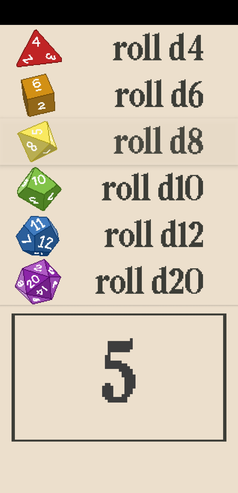
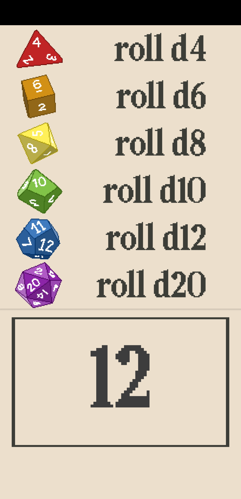

# CritRoll

A simple D&D dice roller made with [Kodular](https://www.kodular.io/) while learning mobile app development. I drew and created all of the app's artwork and assets myself.

## Features

Tap a die to roll a **d4, d6, d8, d10, d12, or d20**. CritRoll displays the result and plays a short dice sound.

## Screenshots

| Dice selection | Roll result |
| --- | --- |
|  |  |

## Included files

- [`critroll.aia`](critroll.aia) — Kodular project source. Import it into Kodular Creator to explore or remix the app.
- [`critroll.apk`](critroll.apk) — Android installation package.
- [`assets/`](assets/) — original dice artwork, buttons, sound, and font files.
- [`screenshots/`](screenshots/) — app screenshots.

## Build

In Kodular Creator, select **Projects → Import project (.aia) from my computer** and choose `critroll.aia`. You can then edit the project and build an APK for Android.

## Credits

Created by **pneftekin** with Kodular. All app artwork and assets were made by me.
